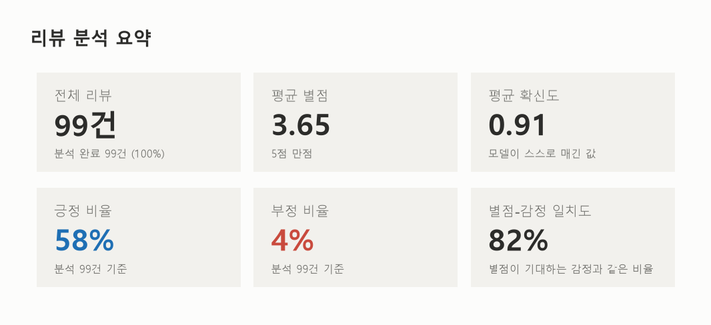
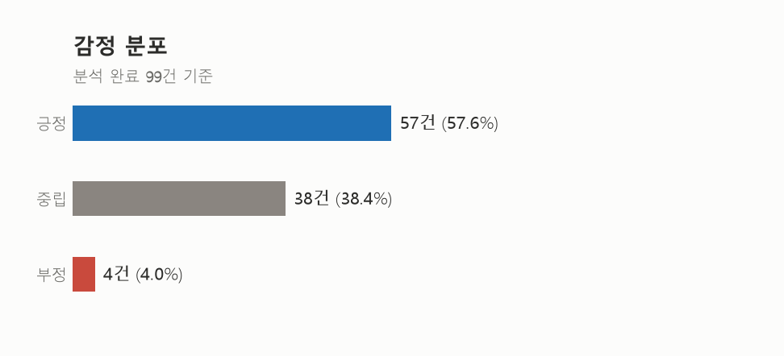
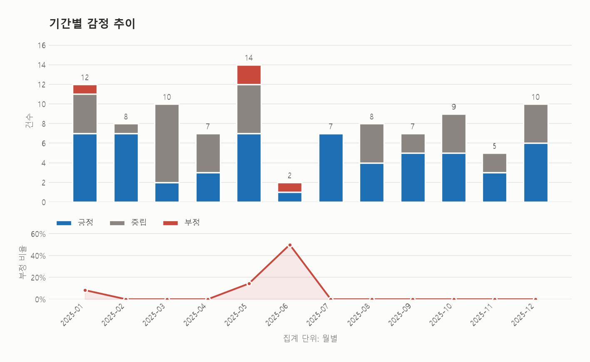
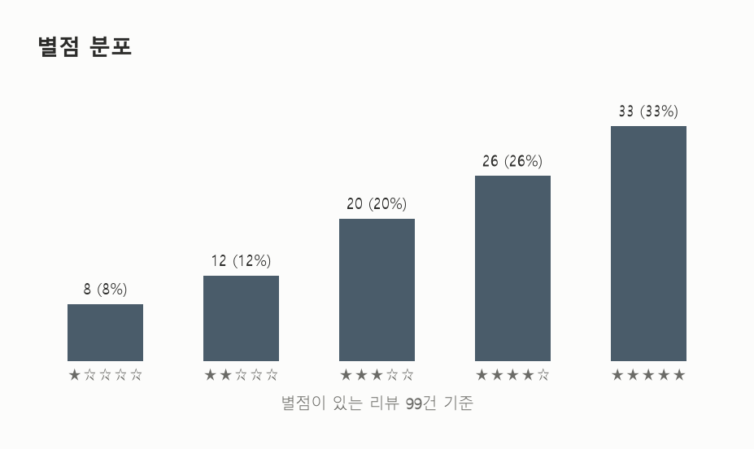
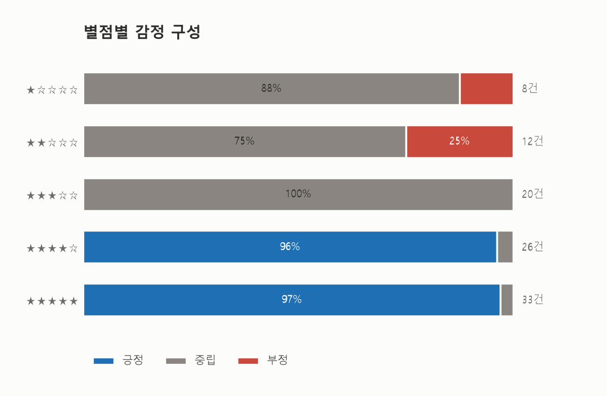
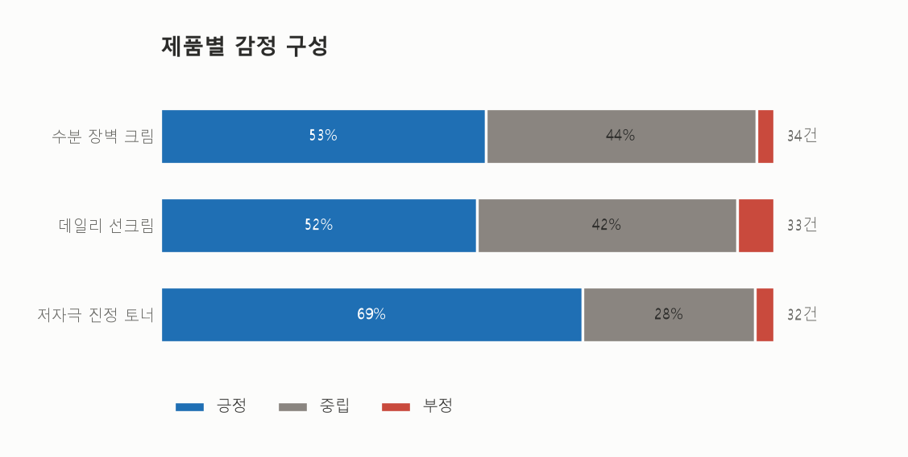
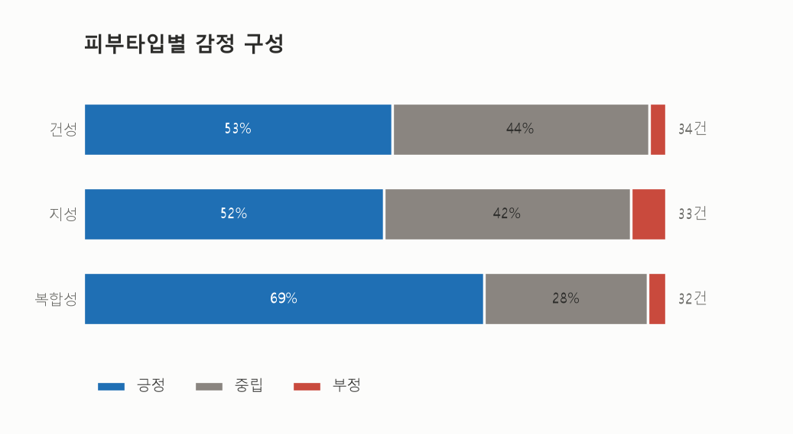

# 고객 리뷰 분석 리포트

## 주요 통계

- 전체 리뷰 수: 99
- 분석 완료: 99
- 미분석: 0
- 분석률: 100.0%
- 평균 별점: 3.65
- 평균 분석 신뢰도: 0.91

### 감정 분포
- positive: 57건 (57.6%)
- neutral: 38건 (38.4%)
- negative: 4건 (4.0%)

### 별점 분포
- 1점: 8건
- 2점: 12건
- 3점: 20건
- 4점: 26건
- 5점: 33건

## 품질 지표

- 별점-감정 일치도: 81.8%
- 데이터 완전성: 100.0%
- 평균 리뷰 길이: 44.4자

## TOP N

### 리뷰 수가 많은 제품
1. 수분 장벽 크림: 34건
2. 데일리 선크림: 33건
3. 저자극 진정 토너: 32건

### 피부 타입별 리뷰 수
1. 건성: 34건
2. 지성: 33건
3. 복합성: 32건

### 낮은 별점 리뷰
- [1점] 수분 장벽 크림 / neutral / 몇 번 사용하니 코 주변에 좁쌀처럼 올라오는 느낌이 있었어요. 건성이라 여러 번 덧발라도 부담이 크지 않았어요.
- [1점] 데일리 선크림 / neutral / 흡수가 느려서 바쁜 아침에는 사용하기 불편했어요. 지성이라 걱정했는데 얇게 바르니 끈적임이 크게 느껴지지 않았어요.
- [1점] 데일리 선크림 / neutral / 몇 번 사용하니 코 주변에 좁쌀처럼 올라오는 느낌이 있었어요. 지성이라 걱정했는데 얇게 바르니 끈적임이 크게 느껴지지 않았어요.
- [1점] 수분 장벽 크림 / neutral / 처음 바를 때는 괜찮았지만 다음 날 피부에 붉은기가 생겼어요. 건성인데 볼 쪽 당김이 덜해서 만족했어요.
- [1점] 저자극 진정 토너 / negative / 사용 후 얼굴에 작은 뾰루지가 몇 개 올라와서 사용을 중단했어요. 복합성 피부인데 볼은 촉촉하고 T존은 크게 번들거리지 않았어요.

## AI 인사이트

### 긍정 키워드
보습력, 은은한 향, 빠른 흡수, 메이크업 밀림 적음, 저자극, 촉촉함

### 부정 키워드
무거운 사용감, 트러블 발생, 유분 증가, 향 호불호, 느린 흡수

### 전체 요약
전반적으로 보습력, 저자극, 은은한 향, 메이크업 전 밀림이 없는 점에 대해 높은 만족도를 보였습니다. 하지만 피부 타입이나 계절에 따라 무겁게 느껴지거나 뾰루지·붉은기 등의 피부 트러블이 발생하는 아쉬움이 존재합니다.

### 개선 제안
- 지성 피부 및 여름철 사용을 위한 가볍고 산뜻한 오일프리/라이트 제형 라인을 추가 개발합니다.
- 피부 트러블 방지를 위해 논코메도제닉 테스트를 강화하고 호불호 없는 무향 또는 향 선택 옵션을 제공합니다.

## 시각화

